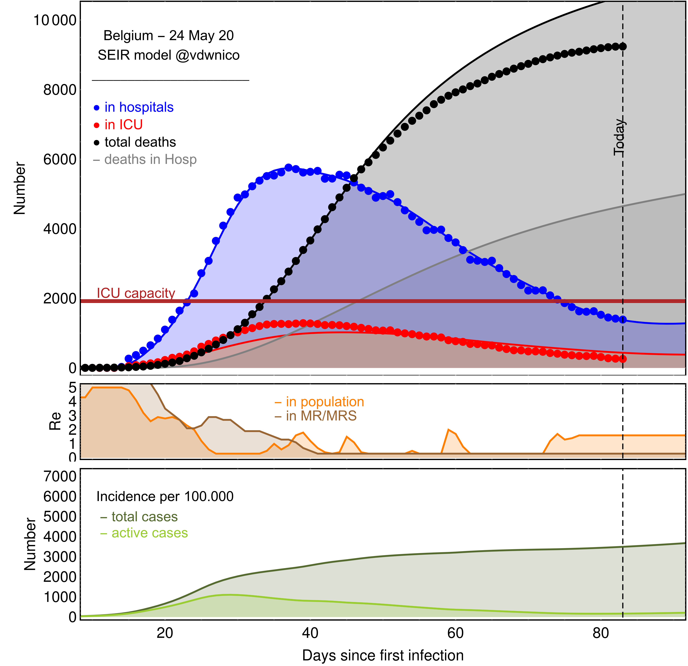
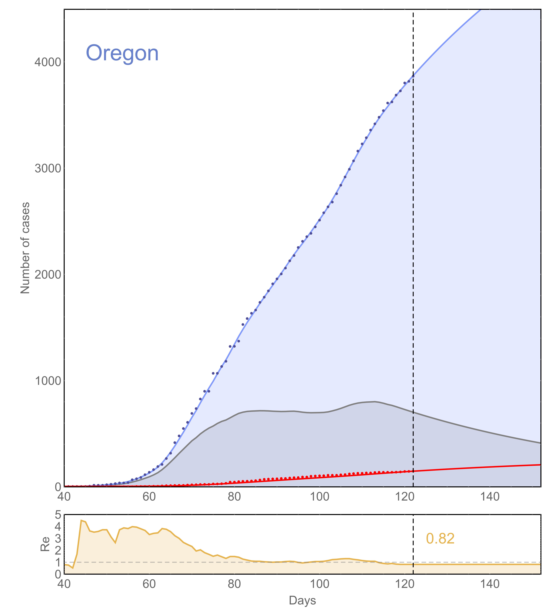
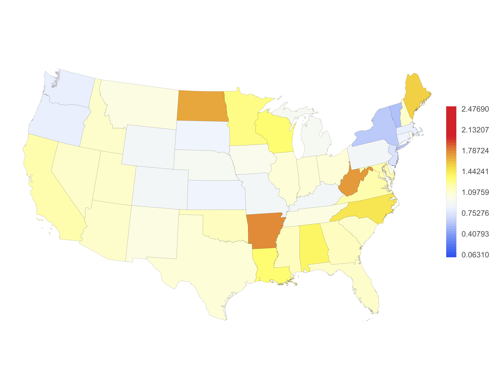
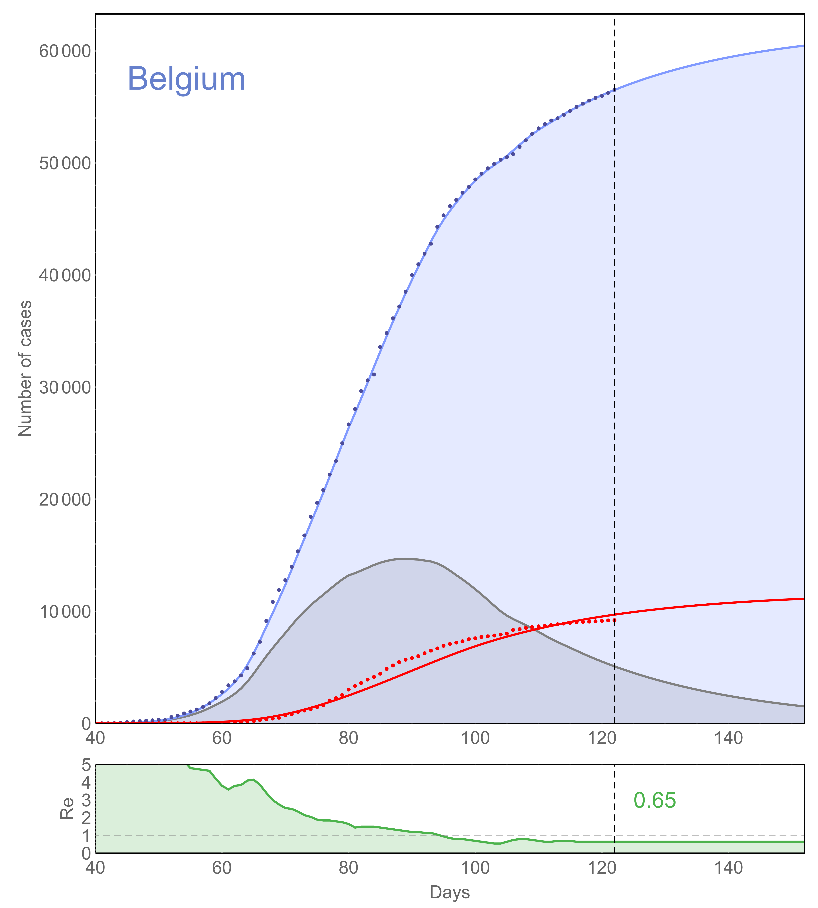
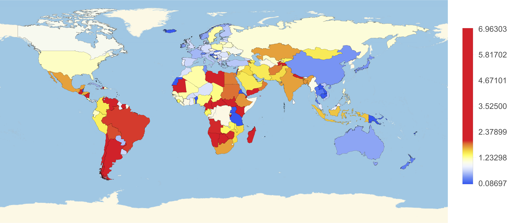

# COVID-19 in Belgium, US and worldwide

## Belgium
1. Run *get-sciensano-data* which will download the latest data for Belgium and create a CSV file for every tab.
2. Run the *Mathematica* notebook ***SEIR-Belgium.nb***.

## USA
1. Run *get-johns-hopkins-data*	to download the latest data for all countries.
2. Run the *Mathematica* notebook ***SIR-US.nb***.

## Worldwide
1. Run *get-johns-hopkins-data*	to download the latest data for all countries.
2. Run the *Mathematica* notebook ***SIR-World.nb***

 

---

# COVID-19 in Belgium

This repository gathers models of the COVID-19 epidemics in Belgium. It is developed and maintained by researchers from the University of Liège, including Nicolas Vandewalle, Eric Opsomer, Gilles Louppe and Antoine Wehenkel.

Our goal is primarily to provide educational materials in order to better understand the mathematics behind models of epidemics and to sensitize everyone to the requirements of protection measures. 

**Disclaimer**: All models are wrong, but some are useful. Results presented across these notebooks should **not** be interpreted as crystal ball forecasts. 

